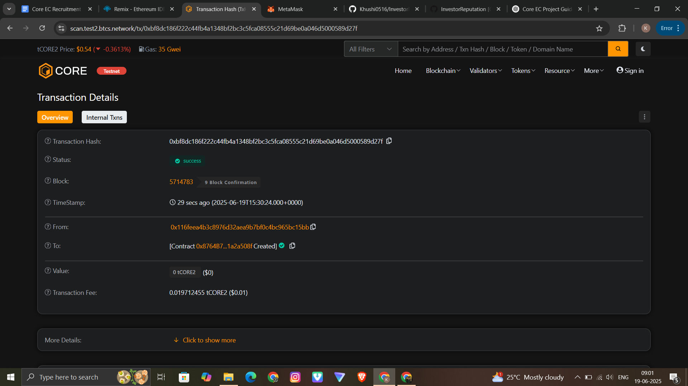

# Investor Reputation

## 📌 Project Description

The **Investor Reputation** smart contract tracks the reputation of investors based on their total investments and the success of their campaigns. It dynamically updates a score and tier level using on-chain data, encouraging positive behavior in investment ecosystems like crowdfunding platforms.

## 🎯 Project Vision

To incentivize trustworthy and impactful investing by quantifying investor reputation in a transparent, decentralized manner.

## 🚀 Key Features

- ✅ Tracks total investment and successful campaign count for each investor.
- 📈 Calculates a **reputation score** using investment and campaign success.
- 🕒 Applies **10% annual decay** to prevent inactive users from retaining high scores unfairly.
- 🏆 Assigns **tier levels** (1–5) based on score to segment investors by performance.
- 📊 Provides viewable investor profiles.

## 🔮 Future Scope

- Add integration with external investment platforms for auto-updating reputation.
- Gamify investor tiers (e.g., rewards or badges).
- Enable NFT issuance to high-tier investors.
- Governance voting power proportional to reputation score.
- Add admin controls or DAO-based moderation of updates.

## 📄 Smart Contract

- **Contract Name**: `InvestorReputation.sol`
- **Compiler Version**: `^0.8.20`

## 🛠 Deployment Info

- **Network**: Core Testnet
- **Deployed Address**: `0x8764b720d6f53b1b163ec54e4674ba5e1a2a508f`  

## 🔗 Block Explorer

- [View Transaction on Core Testnet Explorer](https://scan.test2.btcs.network/)  
  *0xbf8dc186f222c44fb4a1348bf2bc3c5fca08555c21d69be0a046d5000589d27f*

## 🖼 Transaction Screenshot

  

